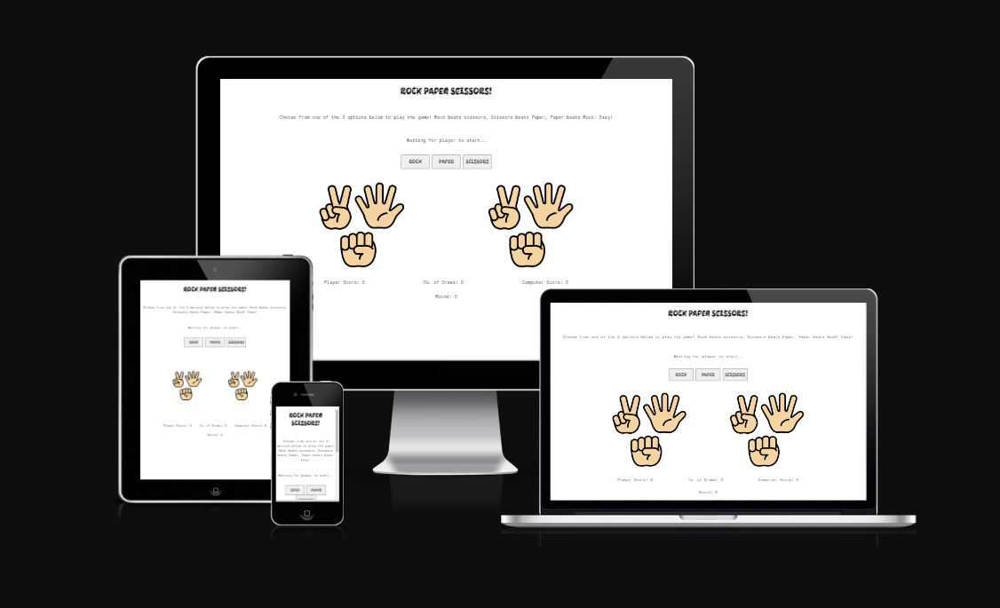
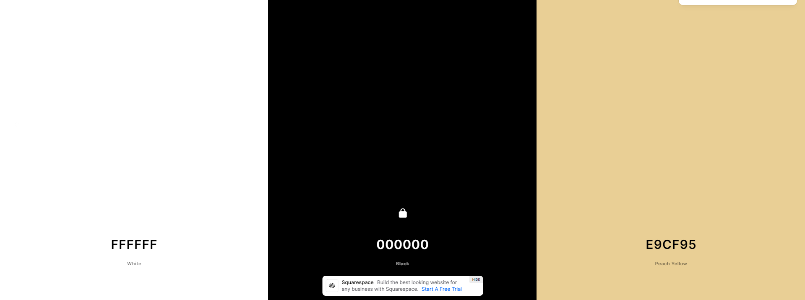
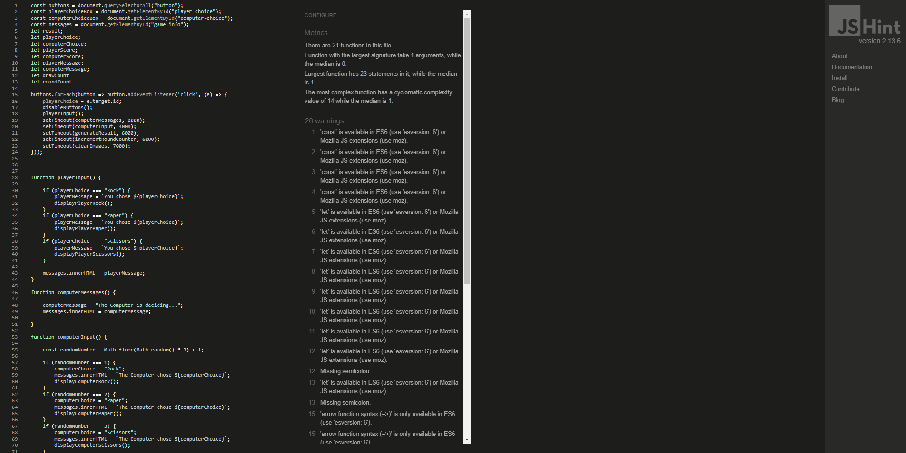
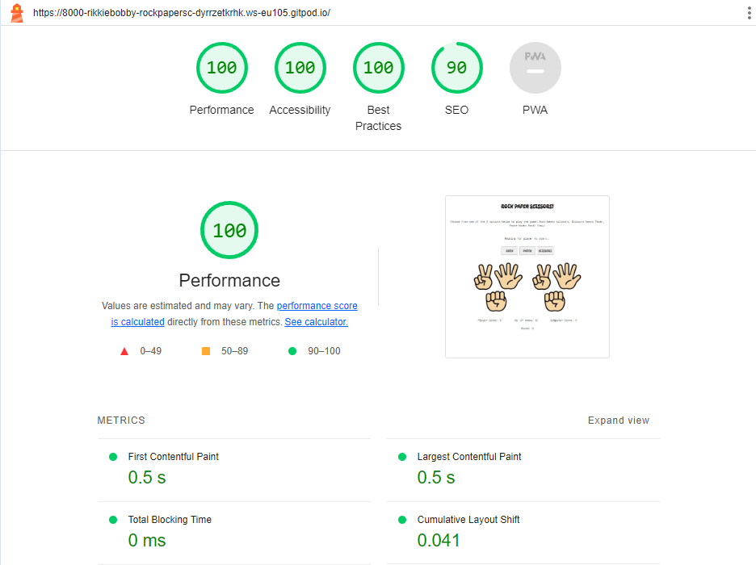
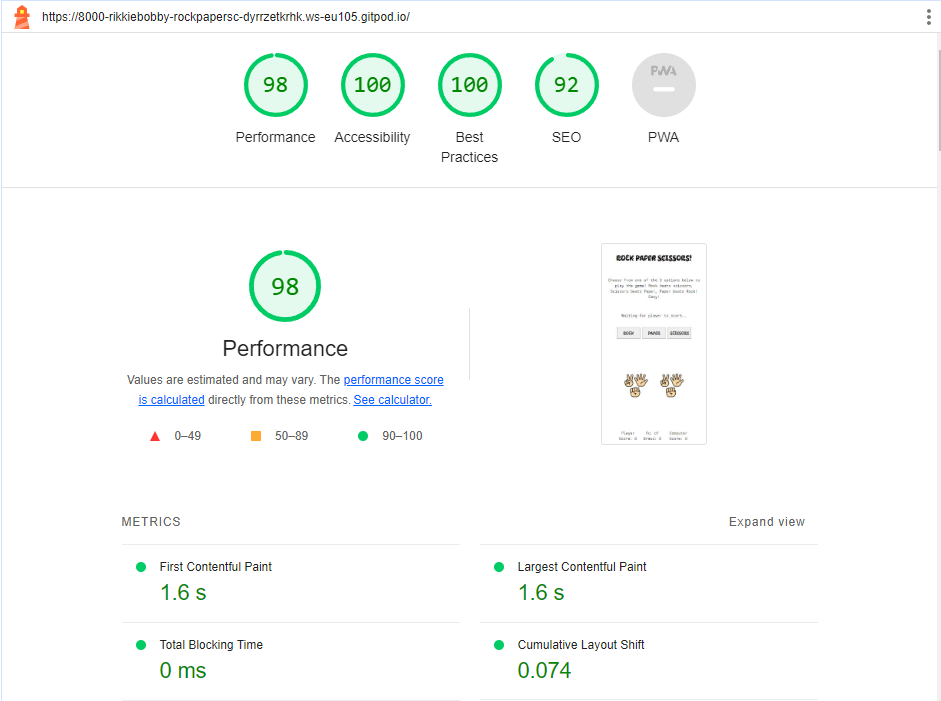

# Rock-Paper-Scissors-JS
Rock-Paper-Scissors-JS is an interactive website where users can visit the webpage and play some quick round games of rock, paper, scissors! Though the site wouldn't gain much traction beyond some childrens entertainment value or revisitng the site to add improvements, the functionality is the main focus and how this was achieved.

As I was stuggling with JavaScript up to this point, for this project I decided to take some insparation from Matt Rudge and make a RPS game with using some simple and easy to understand syntax. This allowed me understand further what was happening on the page.

You can find the live site [here](https://rikkiebobby.github.io/Rock-Paper-Scissors/).


# Contents
+ [User Experience](#user-experience)
  + [User Stories](#user-stories)
  + [Design](#design)
    + [Overall Feel](#overall-feel)
    + [Colour Scheme](#colour-scheme)
    + [Typography](#typography)
+ [Features](#features)
  + [Current Features](#current-features)
  + [Possible Future Features](#possible-future-features)
+ [Technologies Used](#technologies-used)
  + [Languages Used](#languages-used)
  + [Frameworks Libraries & Programmes Used](#frameworks-libraries-and-programmes-used)
+ [Testing](#testing)
  + [Validator Testing](#validator-testing) 
  + [Lighthouse Testing](#lighthouse-testing)
  + [Other Testing](#other-testing)
+ [Deployment](#deployment)
  + [Deployment through GitHub Pages](#deployment-through-gitHub-pages)
  + [Forking the Repository](#forking-the-repository)
  + [Cloning Project](#cloning-project)
+ [Credits](#credits)
  + [Content](#content)
  + [Media](#media)
  + [Acknowledgements](#acknowledgements)
---
---
# User Experience
## User Stories
#### As a user: 
+ I want to able to play a game of rock, paper, scissors against the computer.
+ I want to be able to see the game unfold.
+ I want to be notified of when I when or loose the game.
+ I want to see mine and the computers scores.
+ I want to know what round is currently being played
## Design
### Overall Feel
Overall the designed is quite basic, more attention was put into getting the Javascript working so this would be soething to revisit and improve in the future
### Colour Scheme
Again similar to the design the color scheme is also quite basic, black and white with some color from the images used to break it up.

### Typography
As this was going to be a gaming website I decided to use some old arcade sytle fonts from google fonts to give it a slightly 90s arcade store feeling, using the [kablammo](https://fonts.google.com/specimen/Kablammo?query=kablammo) font in places suvh as titles and the buttons, and [orbit](https://fonts.google.com/specimen/Orbit?preview.text=howiye&preview.text_type=custom&query=orbit) for the instructions and messages. Both fonts were taken from [googlefonts](https://fonts.google.com/)
---
---
# Features
## Current Features
+ Page has been designed to be fully responsive to all screen sizes with functionality.
+ Images on the page change depending on the player and computer inputs.
+ Messages which appear onscreen informing the player of whats happening.
+ A score and round counter which increments as the game is played.
+ Buttons disabled while playing to prevent the game from glitching.
## Possible Future Features
+ The design could use some improvements, adding some changes and animations to the buttons, a color scheme etc.
+ A footer with social media links
+ Email signup to a newsletter
---
---
# Technologies Used
## Languages Used
+ [HTML5](https://en.wikipedia.org/wiki/HTML5)
+ [CSS3](https://en.wikipedia.org/wiki/CSS)
+ [JavaScript](https://en.wikipedia.org/wiki/JavaScript)
## Frameworks Libraries and Programmes Used
+ [Font Awesome](https://fontawesome.com/) used for icons.
+ [GitHub](https://github.com/) used to host repository.
+ [GitPod](https://www.gitpod.io/) used to develop project and organise version control.
+ [GitHub Pages](https://pages.github.com/) Pages used to deploy the site.
+ [Lighthouse](https://developers.google.com/web/tools/lighthouse) for performance review.
+ [AmIResponsive](https://ui.dev/amiresponsive) used to check site was responsive on different screen sizes.
---
---
# Testing
## Validator Testing
At the completion or heavy editing of sections, I used the following to check my code for syntax errors:
+ [HTML](https://validator.w3.org/) 
  + All pages came back with no errors.
+ [CSS](https://jigsaw.w3.org/css-validator/)
  + CSS came back with no errors. 
  + CSS did display warnings but they're all in relation to vendor prefixes. 
+ [JavaScript](https://jshint.com/)

  + JavaScript did display some lines of code which were missing semi-colons at the end of statements which were fixed

    
  + The validator did display these warnings, however these did not affect the code in any breaking way
  
## Lighthouse Testing
I used Chromes Lighthouse tools to test site performance. I check bothed desktop and mobile performances. Below are the screenshots from both tests:
### Lighthouse Desktop

### Lighthouse Mobile

## Bugs and Fixes
+ One bug I encountered was when trying to get the JS functions to fire off one after another, however instead they would try to execute at the same time, to prevent this is used the setTimeout function to allow the functions to work in a sequence one after another.
+ I also noted a synax error on lines 148, 152 and 156 which were preventing the RPS images from displaying, these were fixed when noticed.
# Deployment
## Deployment through GitHub Pages
This site was deployed through GitHub Pages using the following steps:
+ Log into GitHub.
+ Locate the repository.
+ Locate the settings option along the options bar.
+ Locate GitHub Pages options towards the bottom of the page.
+ In 'Source' dropdown, select 'Master' from the branch options.
+ Click the save button.
+ The site is now published though it may not be accessible straight away.
+ The site URL will be visible on the green bar under the section header. This will remain there permanently and you can refer back to it at any time.
## Forking the Repository
+ Log in to GitHub and locate the GitHub Repository
+ At the top of the Repository just above the "Settings" Button on the menu, locate the "Fork" Button.
+ You will have a copy of the original repository in your GitHub account.
+ You will now be able to make changes to the new version and keep the original safe. 
## Making a Local Clone
+ Log into GitHub.
+ Locate the repository.
+ Click the 'Code' dropdown above the file list.
+ Copy the URL for the repository.
+ Open Git Bash on your device.
+ Change the current working directory to the location where you want the cloned directory.
+ Type ```git clone``` in the CLI and then paste the URL you copied earlier. This is what it should look like:
  + ```$ git clone https://https://github.com/RikkieBobby/Rock-Paper-Scissors.git```
+ Press Enter to create your local clone.
---
---
# Credits
## Code
+ I used part of Ania Kubow's tutorial for rock, paper, scissors to get the basic JS for the game into place [RPS tutorial](https://www.youtube.com/watch?v=RwFeg0cEZvQ&t=1289s) 
+ I used the parseInt technique to increment the rounds and scores from Code Institute's Love Maths sample project [Love Maths](https://learn.codeinstitute.net/dashboard)
+ I used StackOverflow to learn about the setTimeout and disable features for JavaScript and help from my mentor [StackOverflow](https://stackoverflow.com/)
## Content
All content was written by Richard Nolan (website creator)
## Acknowledgements
+ To my mom and dad also for helping me get started on this journey
+ To my fellow students and community of CI to help make this process easier to understand and Aurelien Lesage for providing me with support and knowledge when I needed it.
+ And fianlly my mentor Antonio Rodriguez for his patience and support throughout this whole time and helping me move step by step through these projects.